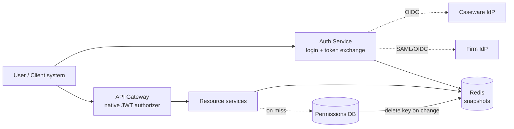
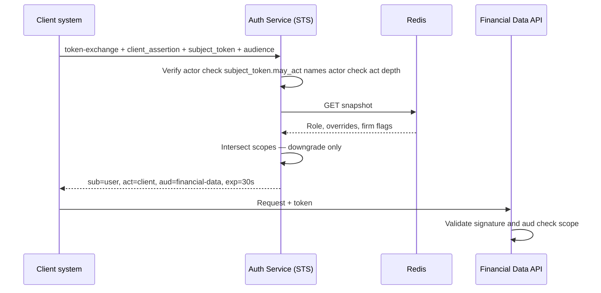

# Collaborate — Identity & Authorization Layer

**Design Document** · Senior Developer, Collaborate

---

## 1. High-Level Architecture

Two components, plus a cache.

**Auth Service.** An existing OAuth 2.0 / OIDC authorization server hosted or deployed alongside Collaborate, exposing three grants: `authorization_code` (with PKCE) for login, `refresh_token`, and `urn:ietf:params:oauth:grant-type:token-exchange` for delegation. I am not building an authorization server. The protocol surface — endpoints, PKCE, federation, refresh rotation, key management, JWKS — is configuration.

The selection criteria are: pluggable external IdPs including SAML, per-client configuration at the scale of one entry per firm, an extension point for custom grants, and control over emitted claims. Every credible option meets these — the .NET-hosted libraries keep it in-process, a standalone server like Keycloak trades that for a separate deployment — so I would defer to whatever Caseware already operates rather than introduce a second identity stack. If a suitable server is already running, this component is configuration rather than new infrastructure.

RFC 8693 is not built in anywhere, but it is a supported extension point in all of them. The custom code is one implementation of that extension interface holding the scope-intersection logic, roughly a hundred lines. That interface boundary is also the seam that keeps this design portable: swapping the underlying server changes where that code plugs in, not what it does.

Login and token exchange are the same logical component and ship as one deployable: one signing key, one JWKS, one issuer, one client registry. They have different traffic shapes — login is human-paced, exchange is machine-driven and burstier — so I would split the exchange into its own deployment when its volume threatens login availability, sharing the signing key via KMS so downstream validation is unchanged.

The service is a relying party to Caseware's central IdP and to each firm's SAML/OIDC provider, and an OpenID Provider to Collaborate's own clients. **Upstream credentials are never passed through.** A SAML assertion or an upstream OIDC token is validated once, mapped to a Collaborate principal via a link table keyed on `(issuer, upstream_subject)`, and discarded. Downstream services see exactly one token format and never learn which kind of IdP authenticated a user.

Federated IdPs assert **authentication only**. Group attributes in a firm's assertion are read and discarded; workspace roles come from Collaborate's database. A compromised firm IdP can therefore impersonate its own users but cannot escalate any of them and cannot reach another firm's workspace. Link rows are created on invitation acceptance, never just-in-time, so a firm IdP cannot self-provision identities.

**Permission snapshots in Redis.** A snapshot keyed `snap:{workspaceId}:{userId}` holds the workspace role, the resource-level overrides applying to this user in this workspace, firm policy flags, and a schema version. Keying per (user, resource) would explode cardinality; snapshots stay small because overrides are exceptional rather than routine.

Reads are **cache-aside**: read Redis, and on a miss read the database and populate. Permission changes **delete the key**; the next read repopulates from current state. There is no snapshot builder, no event bus on the write path, and no invalidation protocol. Delete is idempotent, so duplicate or out-of-order changes cannot corrupt a snapshot, and a lost delete is bounded by a short TTL rather than needing a reconciliation sweep. Redis failing means reads fall through to the database — degraded, still correct.

### Permission checks at speed

The stated load — tens of thousands of checks per second across all firms — is modest per node. The real problem is staleness, not throughput.

Token validation costs no network call: services verify signatures against cached JWKS, so the Auth Service is not on the request path. In front of the resource services, API Gateway's **native JWT authorizer** validates issuer, audience and expiry before a request reaches any service, which means no service implements token handling regardless of language.

Authorization is one Redis read per request. A scoped snapshot accessor memoizes within the request, so an endpoint filtering fifty documents does one round trip and fifty in-memory predicate evaluations. Coarse route-level checks use a policy attribute; resource-level overrides use `IAuthorizationService.AuthorizeAsync(user, resource, policy)`, which is why filtering cannot move to the gateway — the gateway sees the URL, not the rows.

The read-side predicate ships as a thin NuGet package for the .NET fleet — snapshot DTO, Redis read, predicate, handler registration, and nothing else. It is convenience over a documented contract (key format, schema, evaluation order), so a non-.NET service can implement the contract directly. The schema carries a version and the package fails closed on an unrecognised one rather than misreading fields. **The assumption this rests on:** the predicate stays trivial enough to duplicate safely. If policy grows conditional rules, time-bounded grants or role hierarchies, duplication becomes a correctness hazard and a shared engine becomes necessary.

### Revocation

Tokens are not revoked. Access tokens live 5 minutes and assert identity — `sub`, `firm_id`, `sid`, coarse scopes. Authorization is evaluated fresh against the snapshot on every request, so a user removed from a workspace is denied while still holding a cryptographically valid token. Revocation becomes a cache delete rather than a token-lifecycle problem.

Session and account revocation need a second key, since the snapshot cannot express "this session is dead": the same round trip reads `revoked:sid:{sid}` alongside the snapshot via `MGET`. Logout, account disable or admin session-kill writes that key with a TTL matching the token's remaining life.

| Event | Denied after |
|---|---|
| Permission change | next request |
| Session revoked / account disabled | next request |
| Exchanged token already issued | ≤35s (30s lifetime + 5s leeway) |

Long-lived collaborative sessions are the exception, because a WebSocket makes no further authorization calls after connect. Connections re-check every 30 seconds and downgrade to read-only or close with a reason code.

### On-behalf-of and the confused deputy

Both delegation scenarios use the same grant. The caller authenticates as itself — `private_key_jwt` for external clients, task-role identity for internal services — presents a `subject_token` it legitimately holds, and receives `sub` = the user, `act` = the caller, `aud` = exactly one downstream service.

1. The actor authenticates as itself; no shared secrets in headers.
2. The subject token is *presented*, never asserted. There is no "this is user X" parameter.
3. The subject token's `may_act` must name this caller, so a service that merely observed a token in transit cannot exchange it. `may_act` rather than `aud`, since overloading audience to mean delegation permission conflates two things.
4. Output is audience-restricted to one service, so Document Service cannot replay against Financial Data API.
5. Scope = requested ∩ the actor's registered grant ∩ the user's current snapshot ∩ scopes the target audience serves. Downgrade only.
6. 30-second lifetime, non-refreshable.
7. `act` chains are depth-limited to 2 and retained in full for audit attribution.

Because the exchange and the resource service read the same snapshot key, a granted scope can never exceed what enforcement would allow.

**Async delegation** (the notification service acting after a comment is posted) has no inbound user token, and putting one in the event payload would write a bearer credential into durable, retried, dead-lettered storage. Instead the event carries the user ID as *data*, the service authenticates as itself, and the exchange re-derives authority from the user's current snapshot. If the user lost access between the comment and the notification, the delegated call is correctly denied — a token in the queue would have preserved stale authority across exactly that gap. Registration constrains which internal services may request delegation and for which scopes.

**Tradeoff against the stated constraint.** Downstream APIs consume scopes and do not read the permissions database. Coarse scopes therefore ride in the token, the snapshot supplies fine-grained decisions inside services we control, and for APIs outside that control authorization is computed once at exchange time — the 30-second lifetime is what keeps a pre-computed decision honest.

---

## 2. Implementation Plan

| Phase | Scope | Exit criteria |
|---|---|---|
| 0 | Token claim contract, snapshot schema, JWKS, gateway authorizer config | Gateway rejects malformed and wrong-audience tokens |
| 1 | Auth server hosting, PKCE login, per-firm federation, link table | Firm staff and one federated firm can log in |
| 2 | Snapshot read path, cache-aside, delete-on-change, NuGet package | Permission change denied on next request |
| 3 | Token-exchange extension grant | Confused-deputy suite green |
| 4 | Connection-layer re-check | Editing session downgrades within 30s |

Phases 1 and 2 are parallelisable. Phase 3 depends on 2 for scope intersection.

Home realm discovery resolves by invitation context, then email domain, then an explicit picker — invitation links carry unambiguous firm and workspace context, and domain matching is unreliable for contractors and shared-domain clients.

**Migration.** Collaborate already authorizes requests, so there is no flag day. Phase 2 ships in shadow mode: the existing path stays authoritative while snapshot reads run alongside, and divergences are logged in production without being enforced. Cut over per service once divergence reaches zero and holds. Divergence count is the go/no-go, not elapsed time.

**AWS deployment.** Auth Service and resource services on ECS Fargate; ALB for the browser-facing auth endpoints, API Gateway with the native JWT authorizer in front of resource APIs. ElastiCache for snapshots, RDS for the permissions database, DynamoDB for the client and per-firm IdP registry, Secrets Manager for firm client secrets. Signing keys are protected by KMS but held in memory for signing — a KMS API call per token is a latency floor and a per-request cost that exchange volume does not tolerate. Decision logs land in S3 via Firehose with Object Lock, because write-once storage is what makes an audit trail defensible.

---

## 3. Testing Strategy

The decision matrix — workspace role × resource override × firm policy — is table-driven unit tests. It is where a subtle wrong-allow is both most likely and most expensive.

Integration tests use `WebApplicationFactory` with a stubbed IdP and Testcontainers Redis. Fakes sit only at I/O boundaries — snapshot store, signing credentials, client registry. Nothing security-relevant is faked: the predicate, the scope intersection, the `may_act` check and chain-depth limiting all run for real, or the security property is untested.

The valuable cases are negative: expired token, wrong audience, missing `act`, scope escalation attempt, exchange by a caller absent from `may_act`, exchange after revocation, chain-depth overflow, and an unrecognised snapshot schema version. These become a permanent security regression suite.

Revocation is asserted, not assumed: change a permission, poll until denied, fail the build above threshold.

---

## 4. Evaluation & Observability

Every decision emits a structured record: subject, full actor chain, resource, decision, the policy clause that decided it, and the snapshot version read. Denials at 100%, allows sampled. The deciding clause matters most — "denied" without a reason is unactionable at 2am.

- Authorization latency p50/p99, and cache hit ratio
- **Database fallback rate** — the leading indicator of cache failure
- Revocation latency, from change to first denial
- Exchange volume and denial rate per actor; a denial spike on one actor is a credible compromise signal
- `act` chain depth distribution
- Federated login failure rate per firm, which is how a firm's expiring signing certificate surfaces before their users call support

The `act` chain must reach the immutable audit trail. In audit and assurance software, attributability of a delegated action is a compliance requirement, not telemetry.

---

## 5. Failure Modes & Tradeoffs

**Redis unavailable.** Reads fall through to the database with load shedding. Cache-aside degrades to slow-but-correct rather than failing closed, which is the main reason I prefer it to materialising snapshots ahead of time.

**Lost delete.** A short snapshot TTL bounds staleness. Correctness never depends on a delete arriving, which is why no reconciliation machinery is needed.

**Bearer tokens are replayable.** Possession is sufficient, so short lifetimes and audience restriction are the only controls once a token leaves Caseware's infrastructure. For the external client path I would sender-constrain exchanged tokens via mTLS binding (RFC 8705) — these clients already authenticate with certificates — which removes replay as a threat rather than narrowing its window. Stated as a known limitation of the current design.

**SAML validation.** XML signature wrapping is a live attack class. Assertion IDs go in a replay cache for the validity window, and signature scope is verified against the parsed assertion. This is the clearest case in the design for using a hardened library rather than custom code.

**Federated logout.** If a firm terminates a session on their side, Collaborate does not find out. Back-channel logout is supported where the IdP offers it; SAML Single Logout is treated as best-effort rather than pretended to be solved.

**Snapshot cardinality.** A user in thousands of workspaces breaks the small-snapshot assumption. Cap size and fall back to per-request lookups for those outliers rather than degrading the common path.

**What I traded away.** Fat tokens carrying full permissions would remove the read entirely — rejected because resource-level overrides bloat tokens unboundedly and staleness becomes unfixable. Materialising snapshots at write time via a builder service would make reads slightly cheaper — rejected because it needs an outbox, ordering guards and a reconciliation sweep to be correct, and it fails hard when Redis is unavailable where cache-aside fails soft. Distributing a policy engine as a library or sidecar would allow richer policy — rejected because this model does not need the expressiveness, and it buys an ownership seam and a fleet-wide release blast radius. The design keeps the request path to one cache read and pushes everything else to configuration or to write time.
